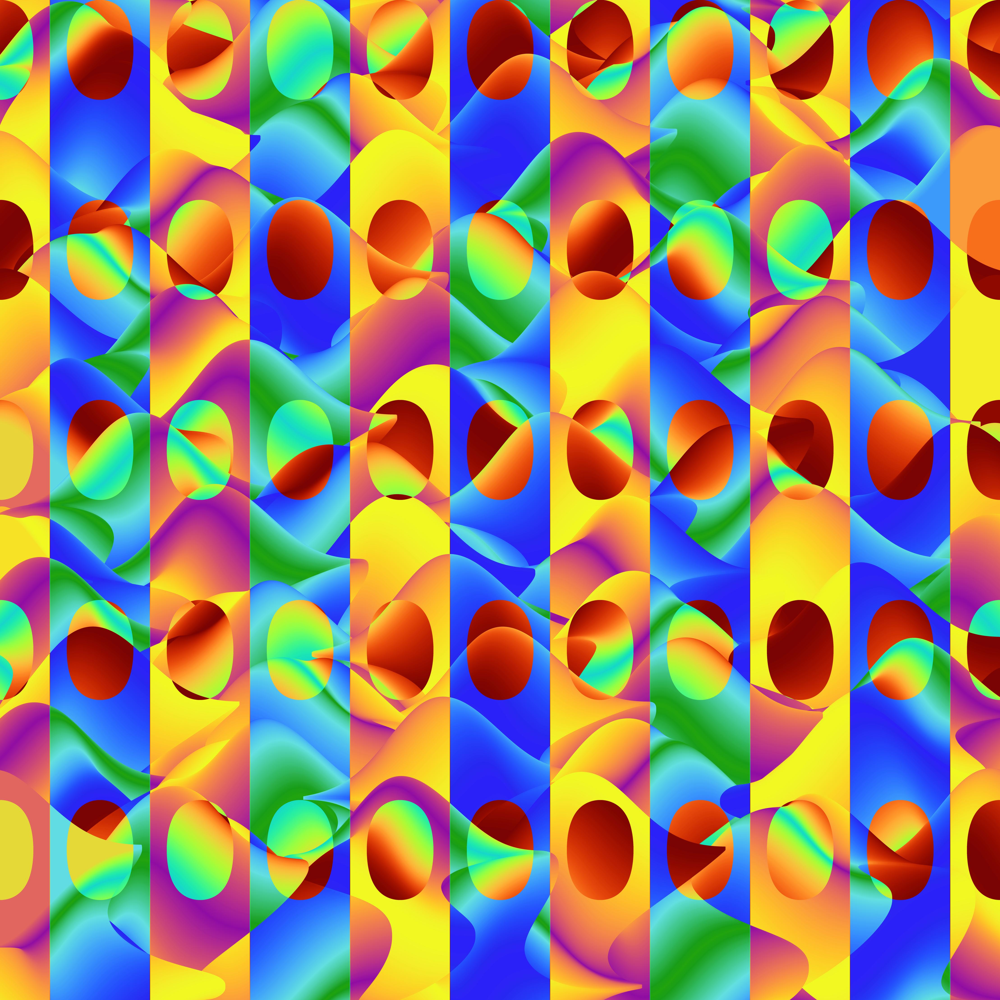

# ScriptedStyles  

**Algorithmic Art + Automation in Python**  

ScriptedStyles is a Python-based framework for generating and automating digital artwork using mathematical algorithms, image processing, and data-driven visualization methods.  

Originally begun as a personal project, it has evolved into a platform for experimenting with:  
- **Algorithmic generation** of patterns, structures, and visual forms.  
- **Scientific visualization** techniques applied creatively.  
- **Automation pipelines** for bulk processing and uploading images (e.g., Instagram, Etsy, Pinterest).  
- **Exploration of applied math and physics concepts** through code.  

---

## Features
- Mathematical and algorithmic artwork generation (fractals, diffusion, tilings, geometric patterns).  
- Reproducible workflows built in Python using **NumPy**, **Matplotlib**, and **SciPy**.  
- Modular codebase for testing new generative ideas.  
- Automation stack for batch-uploading to social and e-commerce platforms.  
- Example image sets included in `sample_images/`.  

---

## Project Structure

```
designs/
  fractals/           Collatz sequences, Mandelbrot sets
  differential_equations/  Euler method, finite difference, heat diffusion
  geometric_patterns/ Lines, triangles, spatial transforms, quilts
  heatmaps/           Turtle density, superformula, flower patterns
  random_walks/       2D random walk visualizations
  particle_simulations/  2D gas, pool ball collisions
  image_processing/   Alpha etching, adaptive thresholding, paintbrush
  curves/             Overlap plotting, Weierstrass, superformula, exponential
  words/              Text-based generative art
  ai/                 AI-assisted generation (Lichtenberg, GPT-driven)
  vector_field/       Magnetic field visualizations
  utils/              Shared image processing helpers
automation/           Historical e-commerce pipeline (Printify, Instagram)
sample_images/        Example outputs
docs/                 Privacy policy, data deletion
tests/                Smoke tests
```

---

## Usage

**Requirements:**  
- Python 3.10+  
- NumPy, Matplotlib, SciPy, OpenCV, Pillow  

**Quick start:**  
```bash
git clone https://github.com/hschn58/Scripted_Styles.git
cd Scripted_Styles
pip install -e ".[dev]"

python designs/heatmaps/flowers_v4.py     
```

---
**Generated Samples**

Here are a few representative outputs generated with the scripts in this repo:

<p align="center">
  
  
  
</p>

*(Click thumbnails to view full size. See the `sample_images/` folder for more.)*

**Real-World Deployment**

This not only functioned as a personal project but used to be an active e-commerce automation pipeline:

- **Artwork generation** → produced in Python using the scripts in this repo.  
- **Fulfillment** → connected via Printify to create physical products.  
- **Storefront** → integrated with Etsy to manage product listings.  
- **Marketing** → automated posting of generated images to Instagram and Facebook to drive engagement.  

**Links to deployed channels:**  
- Instagram: [@scriptedstylesart](https://www.instagram.com/scriptedstylesart)  
- Facebook: [ScriptedStyles](https://www.facebook.com/profile.php?id=61572520106684)  
- Etsy: [ScriptedStylesArt Shop](https://www.etsy.com/shop/ScriptedStylesArt)  

---

## Notes
Many of these scripts were used to generate professional, large, high-resolution images.

- Created images can exceed **50 MB+**.  
- Depending on the project and your hardware, rendering can take **20–30 minutes (or longer)** on a standard laptop.  
- Reducing parameters such as `dpi` or `grid_size` (when available) can significantly decrease file size and runtime.


## License

This project is licensed under the [MIT License](./LICENSE).
